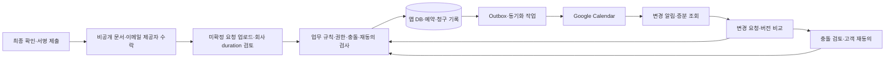

# KCP Google Calendar — 양방향 연동·자동 날짜 설정 명세

2026-09-30 P0 설계 · 2026-10-02 제출/확정 경계 갱신 · [입력/상태/재사용 계약](26-kcp-p0-contracts-and-reuse.md) · [전체 순서](25-kcp-quote-to-booking-implementation.md) · [최신 고객 흐름](32-client-quote-signature-submission.md)

**현재 구현과 목표 계약:** [28번 Gmail 문의→Calendar](28-gmail-enquiry-calendar-implementation.md)의 회사 Supabase·OAuth 연결과 요청/제안 양방향 검토를 [10월 1일 실제 검증](../verification/2026-10-01-google-oauth-live.md)에서 확인했다. 아래 전체 계약에는 아직 미구현인 예약 확정·인보이스·watch가 포함된다. 10월 2일에는 [31번 연결 복구](31-google-integration-recovery-and-operation-plan.md)와 [32번 고객 제출 경계](32-client-quote-signature-submission.md)를 진행하며 실제 완료는 TODO·검증 기록으로 구분한다.

## 1. 사용자 결정과 데이터 기준

예약 날짜·시간·기간, 관련 업무 일정과 인보이스 날짜를 Google Calendar에 자동 생성·갱신한다. 사용자는 **Google에서 직접 바꾼 날짜·시간·기간도 앱에 가져오되 검증 후 확정**하는 방식을 선택했다. 변경은 자동 수집하며 충돌·고객 재동의·청구 권한이 필요한 경우 검토 상태로 보낸다. 이 문서의 최초 P0에서는 계정 연결을 하지 않았지만 10월 1일 회사 계정의 시험 연결을 완료했다.

**2026-09-30 추가 결정:** Google Calendar와 외부 서비스 연동에 사용할 회사 계정은 `Lnkgroupsydney@gmail.com`이다. 프로젝트의 마지막 작업을 끝내고 사용자가 앱의 **Complete** 버튼을 누르면 최종 인보이스를 발행하고, 납기는 **실제 발행일 + 3일**로 설정한다. 이 명세에서 3일은 Sydney 기준 **달력일**로 해석한다(주말·공휴일 포함, 영업일 또는 72시간이 아님). 근무시간·기간 계산 규칙은 보류하며 정찰제는 회사 가격 자료 수령 후 진행한다.

**2026-10-02 제출 경계 확정:** 고객 정보 저장·Gmail 수신·가격 approve만으로 자동 일정을 만들지 않는다. 고객의 최종 확인·전자서명·제출 → 비공개 견적/서명 계약 문서 생성 → 고객 이메일 제공자 수락 → 회사 Calendar 업로드 순서다. 문서·메일·앱·Calendar 모두 **회사 기간·충돌 확인 전 요청(pending confirmation)**을 표시한다. **이미 예약된 날짜는 고객 달력에서 선택 불가**이며 서버에서도 다시 검사한다. 최종 확정은 회사의 기간·자원·전체 충돌 확인 후 수행하고, 고객에게 제시한 조건이 바뀌면 필요한 재동의·재서명을 받는다.

앱 DB는 견적·고객 수락·자원 점유·청구·입금의 업무 기록이고 Google Calendar는 그 일정을 보고 수정하는 운영 채널이다. Google 이벤트 삭제나 제목의 ‘Paid’ 표시는 계약 취소·입금 증거가 아니다. Google의 외부 busy 일정은 가용성 입력으로 사용한다. 고객에게는 가능한 시간과 요청/확정 상태만 보여준다.

## 2. 캘린더 구성과 표시 내용

회사 소유의 **작업 캘린더와 청구 캘린더를 분리하고 Google 화면에서 함께 보는 안**을 기본 설계로 한다. 인보이스 정보는 회계/관리자에게, 작업 정보는 배정 직원에게 공유할 수 있다. 복수 팀/부스가 있으면 자원 캘린더를 mapping한다. 실제 개수·소유자·공유 권한은 회사 확인 후 설정하고 개인 캘린더를 자동 선택하지 않는다.

| 업무 이벤트 | Google 표시·자동 생성 기준 | 시간 차단 |
| --- | --- | --- |
| 최종 제출 후 예약 요청 | submission 참조·희망일·‘Pending confirmation’·권한 있는 앱 링크. 문서 생성·이메일 제공자 수락 이후 자동 생성 | `transparent`. 시간 미정이면 종일 요청 표시. 업로드 성공으로 예약 확정/자원 확보하지 않음 |
| 담당자 검토용 제안 | 기존 웹/Gmail 문의를 담당자가 별도 검토해 지정한 날짜·접수 번호 | `transparent`. 고객 최종 제출 경로와 구분하며 수신 자체로 자동 생성하지 않음 |
| 방문/실제 작업 | 승인된 방문 또는 작업 세그먼트의 시작·종료·담당 자원 | `opaque`. 실제 점유 시간만 차단 |
| 프로젝트 전체 기간 | 시작부터 예상 완료까지 요약, 단계·진행상태 | `transparent`. 요약과 실제 작업을 중복 점유하지 않음 |
| 건조·공방·재설치 | 해당 단계의 기간·필요 자원·재설치 시간 | 인력 불필요 건조는 인력 차단 안 함. 부스 사용은 부스 자원만 차단 |
| 유효 임시 점유 | 전체 작업 구간의 예약 대기·만료 시각 | 자원별 `opaque`. 만료 후 해제 작업·대사, 무기한 방치 금지 |
| 인보이스 발행 예정 | 작업 일정이 정해지면 예상 마지막 작업일에 ‘발행 예상·Complete 대기’ 표시 | `transparent` 종일. 예정일 도래로 발행하지 않음 |
| 인보이스 실제 발행 | 발행 사건 발생 시 발행일·문서 번호·앱 열람 링크 | `transparent` 종일. 발행일은 기록된 사실 |
| 최종 인보이스 납기 | 실제 발행일 + 3 달력일과 미수/입금 상태 | `transparent` 종일. 발행 전 예상 납기는 별도 라벨, 예약금/중도금은 정책 승인 전 생성 안 함 |
| 결제/입금 완료·연체 | 검증된 입금 사건으로 완료일 표시, 미수 상태에 따른 기존 이벤트 라벨 갱신 | `transparent`. 연체 날짜마다 중복 이벤트를 무한 생성하지 않음 |

예약·청구 이벤트에는 참조번호·업무 종류·상태·필요 최소 지역·권한 있는 앱 링크를 넣는다. 사진·서명 URL·접근 토큰·전체 견적/금융 내역은 넣지 않는다. 주소는 배정 직원의 현장 일정에 필요한 경우에만 공유 권한을 확인해 넣는다. `visibility=private`만으로 회사 캘린더 접근통제가 끝났다고 보지 않고 Calendar 공유 권한과 내용 최소화를 함께 적용한다. 고객을 자동 참석자로 추가하거나 고객 Google 계정을 요구하지 않는다.

Google은 `transparent` 이벤트를 시간 비차단, `opaque`를 차단으로 정의하고 이벤트 종료는 exclusive다. 날짜만 있는 하루 이벤트는 다음 날을 종료일로 전송한다. 시간 이벤트는 `dateTime`과 `Australia/Sydney`를 사용한다. [Events 필드](https://developers.google.com/workspace/calendar/api/v3/reference/events)

## 3. 날짜·시간·기간 자동 설정 규칙

회사에서 한 번 승인한 규칙을 버전 관리하고 예약/청구마다 해당 버전을 남긴다. 최종 청구 정책은 `project_complete / due_days=3 / day_basis=calendar / timezone=Australia/Sydney`로 명세한다. 아직 없는 근무·기간 규칙은 `policy_required`/`duration_required`로 표시하며 임의 1일·09:00 등을 채우지 않는다. 홈페이지의 문의 가능 시간과 작업/건조 3~7일 안내를 예약 근무시간·자동 기간 산식으로 사용하지 않는다.

| 결과 | 계산 입력·규칙 | 변경 시 동작 |
| --- | --- | --- |
| 시작 후보 | 고객 희망일/시간대 + 회사 영업시간 + 자원·휴무 + 앱 점유 + Google busy | 가능한 후보 제시. 자동 선택 정책 미정이면 고객/담당자가 선택 |
| 실제 작업 구간 | 회사 승인 duration 템플릿 또는 담당자 설정 + 일별 작업시간·버퍼·자원 | 비연속 날짜/여러 방문을 segment로 분리, 모든 구간 충돌 검사 |
| 예상 완료일 | 작업·건조·재조립 단계 의존성과 자원 일정의 마지막 종료 | duration 변경 시 영향 범위만 다시 계산 |
| 발행 예정일 | 일정의 예상 마지막 작업일. 일정 미정이면 날짜 없음 | 미발행 예상만 재계산. Complete를 대신하는 자동 발행 조건이 아님 |
| 실제 발행일 | 마지막 작업 후 사용자의 프로젝트 Complete → 발행 조건 검사 → 실제 발행 성공 시점의 Sydney 날짜 | `completed_at`과 `issued_at`을 분리. 재시도로 날짜가 바뀌면 실제 발행일 사용 |
| 납기일 | `due_on = issued_on + 3 calendar days`, Sydney 현지 날짜 연산 | 주말·공휴일에도 연장 없음. 발행 후 변경은 회계 권한·필요한 고객 합의와 이력 필요 |
| 입금 완료일 | 검증된 provider 사건 또는 승인된 수동 입금 기록 | 일정 이동으로 paid 처리하지 않음 |
| 리마인더 | 승인된 알림 offset·시간·수신 대상·중복키 | 납기 변경/입금/취소 시 이전 작업 무효화·재생성 |

예: 2026-09-30 발행 → 2026-10-03 납기. 발행일을 0일로 두고 다음 날짜부터 3일을 더한다. 발행 전 예상 납기는 예상 발행일에서 계산하되 확정 납기와 구분하며, 실제 발행 시 `issued_on`을 기준으로 고정한다. 알림 시간·연체 판정 시각은 별도 운영 결정이다. 예약금·중도금은 이번 Complete 정책에 포함하지 않으며 추가 승인 전 자동 청구하지 않는다.

### Complete → 최종 인보이스 처리

1. 회사 소유자 권한을 가진 사용자가 프로젝트의 마지막 작업 종료를 확인하고 **프로젝트 Complete**를 누른다. 서버는 권한·프로젝트 revision·미완료 필수 작업을 검사한다. 일반 직원의 개별 공정 완료, 예정 종료시각, Google의 제목/날짜 변경은 이 명령을 대신하지 않는다. 다른 직원에게 이 권한을 주는 것은 명시적 역할 설정으로만 허용한다.
2. 프로젝트 완료 시각·행위자·revision과 `project.completed` outbox를 같은 트랜잭션으로 기록한다. 완료된 프로젝트와 청구 대기/발행 상태를 따로 보여준다. 미승인 추가금·청구 필수 정보 부족은 `billing_blocked`와 사유로 남기며, 작업 완료 사실을 되돌리거나 발행 성공으로 표시하지 않는다.
3. 발행 작업은 고객이 수락한 최종 견적·승인된 변경과 기입금을 검증한다. `(company_id, project_id, final_invoice)` 유일키와 요청 중복키로 한 번만 발행한다. 더블클릭·응답 유실·worker 재시도·재개 후 재완료에도 기존 청구를 반환하고 새 최종 인보이스를 자동 생성하지 않는다. 외부 회계가 원본이면 같은 참조로 발행 결과를 조회·대사한 후 재시도한다.
4. 실제 발행 성공 시 번호·품목·금액·규칙 버전·`issued_at/issued_on`·`due_on`·후속 outbox를 일관되게 확정한다. 발행 재시도가 다음 날 성공하면 그날 + 3일이며 완료일로 소급하지 않는다. 발행했다고 입금 완료로 바꾸지 않고, 발행 문서 수정은 별도 변경/크레딧 절차를 따른다.
5. Google에 프로젝트 완료·실제 발행일·납기 비차단 이벤트를 생성/갱신한다. Calendar 장애면 기존 인보이스와 납기는 유지하고 동기화만 재시도한다. PDF 생성·전달/메일·Calendar 동기화 상태를 발행과 구분하며 실패 때문에 인보이스를 재발행하지 않는다. 발송 채널·템플릿은 별도 승인 후 연결한다.

재예약은 미발행 청구 계획의 미래 날짜를 재계산할 수 있다. 이미 발행한 인보이스의 발행일·금액·기존 입금은 고정하고 필요한 납기 변경/credit/variation만 별도 절차로 처리한다. 계산에는 UTC 순간값·IANA 시간대와 Sydney 날짜를 구분해 저장하며 DST에서 하루를 항상 24시간으로 더하지 않는다.

## 4. 양방향 수정 계약

| Google에서 한 행동 | 앱의 자동 처리 | 확정 조건 |
| --- | --- | --- |
| 미확정 요청/담당자 제안의 날짜·시간 변경 | 원본 event와 변경 후 값을 비교해 변경 요청 생성 | 유효 날짜·자원/영업 규칙·권한·version 검사. 고객 서명 대상 날짜면 새 제안·필요 재서명 후 적용 |
| 확정 작업 이동·기간 변경 | 기존 확정 예약은 유지하고 새 일정 제안 생성 | 전체 구간 충돌·가격/범위 영향 확인, 필요한 고객 재수락 후 교체 |
| 작업 이벤트 삭제 | 취소 요청으로 접수하고 동기화 이상 표시 | 회사 취소·환불·고객 안내 요건 완료 후 실제 취소/자원 해제 |
| 발행 예정/미발행 납기 계획 이동 | 청구 날짜 변경 요청 | 작업 예정일과 Complete/+3 규칙 일관성·권한 검사. Calendar 드래그로 발행하거나 확정 납기를 임의 지정하지 않음 |
| 실제 발행일/입금일 이동, 금액·Paid 제목 수정 | 업무 사실과 다른 표현으로 분류해 검토·정정 | Calendar만으로 발행/입금 원장 변경 불가 |
| 외부 개인/업무 busy 이벤트 추가·수정·삭제 | 지정 가용성 캘린더의 busy 구간을 갱신 | 새 확정 예약을 자동 생성하지 않음. 기존 예약과 충돌하면 담당자 검토 |
| 이벤트 복사·다른 캘린더로 이동·반복 일정 변환 | 미지원/연결 불일치 변경으로 검토 큐 이동 | 복제 metadata만으로 다른 booking/invoice의 권한 부여 금지 |

확정 작업의 새 제안이 검토 중이면 Google에서 확정시간과 제안시간이 혼동되지 않게 한다. 원래 확정 이벤트는 기존 승인 시간에 복원하고, 제안시간은 별도의 ‘변경 요청’ 비차단 이벤트로 표시하는 방식을 사용한다. 변경을 없던 일로 덮지 않고 사유와 상태를 앱/담당자 화면에 남긴다. 재동의 완료 시 DB 자원 변경·새 Google 값 반영을 처리한다. 원래 예약을 먼저 해제해 고객의 기존 시간을 잃게 하지 않는다.

공유 Calendar의 webhook만으로 편집한 직원 신원을 항상 확정할 수 있다고 가정하지 않는다. 연결/캘린더 권한을 확인하고 중요한 변경은 앱 로그인 담당자에게 검토·승인받아 행위자를 남긴다. 아직 검증되지 않은 Google 입력·설명·링크를 명령이나 HTML로 신뢰하지 않는다.

## 5. 동기화 데이터와 신뢰성

| 데이터 | 최소 필드·제약 |
| --- | --- |
| `calendar_connections` | company·Google subject·grant scopes·상태·재연결 필요·암호화 credential 참조. credential은 서버 전용 |
| `calendar_bindings` | 회사/자원·calendar_id·role(work/billing/availability)·권한·timezone·허용 편집 범위 |
| `calendar_event_links` | binding·entity_kind/id·segment/milestone·generation·Google event_id·etag·업무 revision·payload hash·last_synced_at |
| `calendar_sync_cursors` | binding·syncToken·진행 pageToken·성공 시각·갱신 상태. 완료 전 새 token 확정 금지 |
| `calendar_watch_channels` | channel_id·resource_id·token hash·expires_at·상태·갱신 정보 |
| `calendar_change_requests` | 원래/제안 값·기준 etag/revision·검증 결과·고객 동의·처리자·사유 |
| 공용 outbox/job/audit | 사건 ID·대상 revision·중복키·시도·임대 만료·실패 사유·다음 재시도 |

### 앱 → Google

1. 업무 데이터·revision·outbox를 같은 트랜잭션에 저장한다. 고객 자동 경로는 불변 최종 제출 → 비공개 문서 → 이메일 제공자 수락 사건 이후 Calendar outbox를 생성한다. 초안/Gmail 접수 자체는 이 사건이 아니다. 이메일 수락과 실제 배달/반송은 별도이며 반송 때문에 서명 제출·Google 이벤트를 자동 삭제하지 않는다. 외부 API를 DB 잠금 안에서 오래 호출하지 않는다.
2. worker가 현재 업무 revision을 확인하고 가장 최신 projection을 생성한다. `(회사, 업무 ID, event kind, segment, generation)`당 관리 이벤트 하나를 유지한다.
3. API 형식에 맞는 안정된 event ID와 DB 연결을 사용한다. 생성 응답이 유실되면 같은 ID 조회·mapping 확인 후 복구하고 새 ID로 반복 생성하지 않는다. insert 충돌은 같은 업무인지 확인한다. [생성 계약](https://developers.google.com/workspace/calendar/api/v3/reference/events/insert)
4. update/delete는 저장한 etag와 조건부 요청을 사용한다. `412`는 최신 값을 다시 읽고 충돌 판정하며 무조건 덮어쓰지 않는다. [리소스 버전](https://developers.google.com/workspace/calendar/api/guides/version-resources)
5. Google 성공 후 DB mapping 저장이 실패해도 다음 작업이 같은 event를 회수한다. `extendedProperties.private`의 불투명 업무 참조·revision은 보조 수단이며 DB 소유권 검사를 대신하지 않는다. [추가 속성](https://developers.google.com/workspace/calendar/api/guides/extended-properties)
6. 삭제·재생성은 tombstone/generation으로 구분하고 오래된 outbox가 새 예약을 지우지 못하게 한다. 404/410 삭제 응답도 연결·업무 상태를 확인해 처리한다.

### Google → 앱

1. 승인 캘린더에 초기 전체 조회를 수행하고 모든 페이지를 처리한 뒤 syncToken을 저장한다. 변경 조회에서 삭제 사건·반복 예외도 반영한다. token 무효 `410`은 **동기화 캐시만** 재구축하며 고객·예약·청구 DB를 지우지 않는다. [증분 동기화](https://developers.google.com/workspace/calendar/api/guides/sync)
2. HTTPS 알림은 body에 변경 이벤트가 없으므로 등록된 channel/resource/token 검증 후 조회 작업을 큐에 넣는다. 알림을 예약/입금 변경으로 직접 적용하지 않는다. 만료 전 새 watch를 만들고 겹치는 채널·중복/역순 알림을 허용한다. 알림 번호를 연속 순번으로 가정하지 않는다. [Push 계약](https://developers.google.com/workspace/calendar/api/guides/push)
3. calendar_id+event_id를 mapping하고 마지막 전송 payload/etag와 비교한다. 자기 앱이 쓴 변경은 echo로 처리하고 재전송 루프를 만들지 않는다. 외부 수정은 4절 변경 요청으로 보낸다.
4. 한 캘린더의 cursor 갱신 작업을 직렬화한다. `syncToken`과 호환되는 조회 매개변수를 사용하고 마지막 페이지까지 성공한 뒤 체크포인트를 전진시킨다. [목록 API](https://developers.google.com/workspace/calendar/api/v3/reference/events/list)
5. 알림 유실·만료·장애에 대비해 주기적인 증분 조회·업무/Google 상태 대사를 둔다. 재시도 간격·비용 상한은 운영 설정으로 관리하고 429/일시 실패·권한 회수를 구분한다.

### 예약 충돌과 외부 장애

- 이미 예약된 날짜는 고객 앱 달력에서 disabled로 표시하고 직접 입력/조작한 날짜도 서버에서 거절한다. 응답에는 날짜·가용 상태·조회 유효시점만 제공하고 고객명·주소·이벤트 제목/ID를 내보내지 않는다. 시작일만 빈 것으로 전체 작업 기간을 가용하다고 판단하지 않는다.
- 가용성은 DB 자원 점유와 승인된 외부 Calendar busy를 합친다. 서버가 조회 시각·유효기간·완전성·API/캘린더별 오류를 확인한다. 실패/누락을 빈 시간으로 해석하지 않는다. [FreeBusy 응답](https://developers.google.com/workspace/calendar/api/v3/reference/freebusy/query)
- 이미 전송한 자기 hold/booking 이벤트는 자기 충돌로 계산하지 않는다. FreeBusy만으로 개별 이벤트 식별이 필요해지면 관리 이벤트 목록·DB mapping을 함께 사용한다. 다른 busy 구간까지 통째로 빼지 않는다.
- 최종 제출 시 선택 날짜를 다시 검사하고 회사 확정 시에도 최신 외부 busy와 전체 기간을 재검사한다. 동시에 들어온 요청은 회사 검토 전 확정으로 취급하지 않으며 승인된 hold 정책 없이 무기한 자원을 막지 않는다. 회사 확정 시 DB 제약/잠금으로 전체 자원을 원자적으로 확보한 뒤 관리 이벤트를 반영한다. 관련 Google 반영이 실패하면 `sync_pending/review_required`로 남기고 고객에게 ‘확정 완료’를 보내지 않는다. 제한 시간·보상/hold 해제는 승인 정책을 따른다.
- Google 외부 편집과 DB 쓰기는 원자적으로 잠글 수 없다. 수신 후 재검사·충돌 경고·대체 일정 절차를 두며 외부 수동 편집까지 절대 충돌 0이라고 보장하지 않는다. 이미 확정된 예약은 장애만으로 임의 취소하지 않는다.

## 6. OAuth·접근·자동화 실행 조건

회사 관리자가 지정 계정 `Lnkgroupsydney@gmail.com`의 허용 캘린더만 연결한다. 이 회사 계정의 OAuth·소유 시험 Calendar 접근은 10월 1일 확인했으며 실제 운영 대상과 지속 실행은 별도 결정이다. Gmail 주소이므로 Workspace 관리자 권한이나 domain-wide delegation이 있다고 가정하지 않는다. 회사 소유 OAuth 프로젝트·동의 화면·검증 요구·redirect URI·운영 HTTPS callback·인증정보 설정은 실제 연결 단계에서 확인한다. 기존 Coatly client ID·토큰·개인 계정 설정을 복사하지 않는다.

서버 OAuth authorization-code 흐름과 offline 접근을 사용한다. state는 세션·회사·만료·nonce에 묶고 한 번만 사용하며 redirect 경로를 제한한다. refresh token은 암호화해 서버 전용 저장소에 보관하고 회수·재연결·키 교체를 설계한다. 로그인 공급자가 Google인 직원만 연결할 수 있게 만든 Coatly 제약을 그대로 가져오지 않는다. [OAuth 웹 서버 흐름](https://developers.google.com/identity/protocols/oauth2/web-server)

권한 후보는 소유 캘린더 이벤트의 `calendar.events.owned`, 선택 목록의 `calendar.calendarlist.readonly`, 필요한 외부 가용성의 `calendar.events.freebusy`다. 공유 캘린더·읽기 범위에 따라 필요한 scope를 구현 시 대조한다. 사용자 편의를 이유로 전체 Calendar 삭제/공유 권한을 기본 요청하지 않는다. 앱 안에서도 calendar_id allowlist와 직원 역할을 검사한다. [최소 scope 선택](https://developers.google.com/workspace/calendar/api/auth)

연결 상태는 `not_connected / connected / degraded / reauth_required`. 동기화 상태는 `pending / syncing / synced / retrying / conflict / failed`. 예약·인보이스의 업무 상태와 별도 저장한다. 고객 알림은 앱 업무 사건에서 한 번만 발생하게 하고 Google 참석자 초대와 중복 발송하지 않는다. Calendar 일정 알림과 인보이스 실제 발송은 별도 기능이다.

## 7. 구현 단계에 반영할 작업

| 단계 | 추가할 일 |
| --- | --- |
| P0·최신 계약 | 기존 재사용/양방향 계약에 고객 제출·메일 선행·미확정 요청·회사 확정 경계 추가 |
| P1 | 연결/동기화/변경 검토 상태·작업/청구 일정 표시를 합성 데이터로 확인 |
| P2 | Calendar mapping·outbox·회사/자원 권한과 서버 전용 credential 저장 계약 구현 |
| P3 | 회사 연결 설정·담당자 변경 검토/실패 큐, 승인 후 테스트 OAuth 기반 준비 |
| P6 | 예약 날짜 차단·서버 재검사·서명제출/이메일 후 요청 이벤트·회사 duration/충돌 확인 후 확정·양방향 수정·watch/증분/대사 |
| P7 | 프로젝트 Complete → 최종 인보이스 1회 발행 → 실제 발행일 + 3 달력일 납기, Google 표시·입금 이벤트·재시도 |
| P8 | 실제 테스트 캘린더의 생성/수정/삭제/재연결/충돌·장애 UAT, 운영 인수 |

## 8. 전체 제품 검증 시나리오 — 기존 시험과 구분

| ID | 사례 | 합격 기준 |
| --- | --- | --- |
| GC01 | 같은 outbox 재시도·insert 응답 유실·DB mapping 저장 실패 | 업무/구간당 관리 이벤트 1개, 복구 가능 |
| GC02 | 앱·Google 동시 수정·etag 변경 | 오래된 변경 덮어쓰기 없음, 충돌/재동의 기록 |
| GC03 | 확정 작업 드래그·기간 연장·삭제 | 기존 예약 보존, 검증/고객 동의 후 실제 변경·취소 |
| GC04 | 인보이스/요청 종일 표시·시간 작업·DST·비연속 작업 | 비차단 일정으로 작업 시간이 막히지 않음, 시간/날짜·exclusive end 정확 |
| GC05 | 발행 예정일·납기 이동, 재예약, paid 제목 위조 | 미발행 계획만 허용 재산정, 발행/입금 사실 불변 |
| GC06 | 중복/역순/누락 webhook·watch 만료·syncToken 410·페이지 분할 | 증분 복구·대사, 업무 DB 삭제/중복/누락 없음 |
| GC07 | 권한 회수·캘린더 삭제·API 제한·부분 FreeBusy 오류 | 가용으로 오인 금지, 재연결/재시도·확정 보류 |
| GC08 | 자기 hold·기존 예약 재검사 + 같은 시간 외부 busy | 자기 이벤트만 제외하고 타인 충돌 감지 |
| GC09 | 이벤트 복사/다른 Calendar 이동·반복 예외 | mapping 오염/권한 우회 없음, 검토/정상 busy 반영 |
| GC10 | 직원 권한 축소·개인정보·로그·고객 캘린더 초대 | 허용 직원만 접근, 비밀/사진 비노출, 무단 발송 없음 |
| GC11 | 작업 기간→예상 완료→미발행 예상 청구/납기 갱신 | 같은 승인 규칙 버전으로 계산, 미정 기간은 대기, 예정일 도래만으로 발행 안 함 |
| GC12 | 고객 저장→AI/가격→approve→앱 달력→서명 제출→이메일→요청 Calendar→회사 확정→Complete 청구 | 제출·문서·메일·Google 참조/상태 대조, 메일/Calendar 성공만으로 확정 불가 |
| GC13 | Complete 더블클릭·응답 유실·재완료·직원 권한·미완료 작업·Google 완료 제목 | 권한·작업 상태 검사, 프로젝트당 최종 인보이스 1개, 개별 공정/Calendar 편집으로 발행 불가 |
| GC14 | 금요일 발행·월/연도 경계·Sydney 자정/DST·발행 재시도·Calendar 장애 | 실제 발행일 + 3 달력일(금→월), 완료일 소급 없음, Google 실패에도 청구/납기 보존·중복 발행 없음 |
| GC15 | 예약된 날짜의 UI 선택·직접 API 입력·제출 직전 예약 발생 | UI 차단과 서버 최신 재검사, 전체 기간 미정은 확정 보류, 타인 개인정보 비노출 |
| GC16 | 초안/Gmail 수집·서명 제출·메일 실패·제공자 수락·반송·Calendar 실패 | 제출 경계와 이메일 선행 준수, 개별 복구·중복 방지, 요청/확정·수락/배달 구분 |

공식 문서는 2026-09-30 조회했다. 회사 계정·DB·Google 핵심 연동의 실제 실행 증거는 [10월 1일 기록](../verification/2026-10-01-google-oauth-live.md)을 따른다. 그 기록의 G/C 시험 ID와 이 문서의 전체 GC 시나리오는 다르므로 모든 GC를 통과한 것으로 표시하지 않는다. 고객 서명·메일·확정 예약·청구의 전체 흐름은 후속 검증이다.
