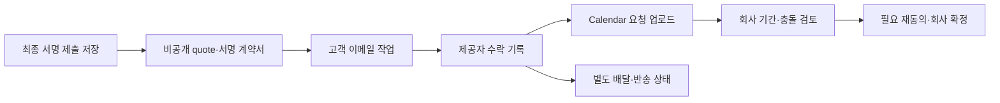

# 고객 정보 저장부터 서명 견적·이메일·회사 Calendar까지

2026-10-02 · Australia/Sydney · 사용자 확정 제품 흐름과 단계 구현 계약

[전체 구현 순서](25-kcp-quote-to-booking-implementation.md) · [진행 TODO](15-home-cabinet-admin-todo.md) · [오늘 연동 복구](31-google-integration-recovery-and-operation-plan.md) · [Google 일정 계약](27-kcp-google-calendar-sync.md)

## 1. 확정 흐름과 현재 범위

**고객 정보·디테일 입력/저장 → 서비스 선택·사진 업로드 → AI 사진 관찰·문제점·승인 가격표 기반 결과 → 고객 approve → 앱 달력 시작일 → 최종 확인·전자서명 → 제출 → 고객 이메일로 최종 견적·서명 계약서 → 회사 Google Calendar 자동 업로드**가 목표다.

추가 확정한 두 가지 조건은 다음과 같다.

- **고객이 서명 제출한 뒤에도 회사가 작업 기간·전체 충돌을 확인해야 예약이 확정된다.** 그 전에는 앱·문서·이메일·회사 Calendar에 `Pending confirmation`을 표시한다. 서명된 요청 조건과 확정된 작업 일정을 구분한다.
- **이미 예약된 날짜는 고객이 선택할 수 없다.** 앱 달력 차단과 서버 재검사를 함께 적용한다. 선택 후 새 예약이 생긴 경우 제출·회사 확정 단계에서 다시 검사한다.

회사 연동 계정은 `Lnkgroupsydney@gmail.com`이고 Supabase는 지정 회사 프로젝트를 유지한다. 기존 Gmail 자동 수집·비공개 문의함·담당자 제안 일정과 실제 Google 양방향 검토는 이 흐름의 운영 기반이다. Gmail 수신이나 최초 웹 초안 저장을 고객의 최종 서명 제출로 바꾸지 않는다.

고객 정보·서비스 초안 저장/복원과 Google 복구 기반을 실제 검증한 뒤, 사용자가 **데모 가격·약관 + 실제 Resend 이메일 → 회사 Calendar 자동 업로드**까지 구현하도록 추가 승인했다. API key 입력은 사용자 확인을 받았다. 확인된 발신 도메인이 없어 **localhost의 회사 계정 전용 시험**으로 진행하며 아래 1.1절이 이번 구현 범위다. 사진·AI·실제 가격표·운영 약관·검증된 고객 신원·법적 계약·확정 예약은 후속이다. 실제 회사 가격·세금·근무/기간을 샘플값으로 운영하지 않는다. 디자인은 기능 검증에 필요한 단계 표시·오류·접근성부터 구현한다.

### 1.1. 10월 3일 목표의 회사 전용 데모 — 10월 2일 실제 검증 완료

실제 데모 완료 증거: [10월 2일 검증](../verification/2026-10-02-demo-quote-email-calendar.md). 전체 테스트 117/117·lint·타입·빌드와 실제 브라우저 제출·회사 Gmail 스팸함 1통/HTML 첨부 2개·Calendar 이벤트 1개, 예약일 차단·새로고침 복원·worker 재실행 중복 없음을 확인했다. 장애·동시 변경·서명 변조는 격리 시험이며 운영 기능 전체 완료와 구분한다.

사용자는 앞서 확인하던 범위를 **샘플 가격·약관을 사용하는 시연 + 실제 Resend 발송 + 이메일 제공자 수락 후 Calendar 자동 업로드**로 확정했다. 2026-10-03(Sydney) 목표는 이 제한된 흐름이며 실제 고객 계약·정찰제 운영 전환을 뜻하지 않는다. 이전의 ‘범위 확인 대기’와 ‘Resend 전체 후속’은 이 데모 승인에 한해 대체한다.

구현 흐름은 **Save service details → Demo approve → 실제 회사 Google busy 기반 날짜 선택 → 최종 데모 요약·이름 입력/그린 서명 → Submit → 불변 Supabase 제출 → 서명된 HTML 문서 2개를 Resend로 회사 계정에 발송 → provider accepted → outbox의 Pending confirmation Calendar 이벤트**다. 사진·AI 결과를 생성한 것으로 표현하지 않는다.

| 경계 | 승인된 데모 구현 | 운영과 구분할 점 |
| --- | --- | --- |
| 실행/발송 범위 | `QUOTE_DEMO_ENABLED=true`와 loopback APP_BASE_URL에서만 활성화. 받는 사람은 `Lnkgroupsydney@gmail.com`, 발신은 `onboarding@resend.dev`로 제한 | 검증된 회사 도메인 없음. 임의 고객/외부 수신자·공개 배포용 발송 금지 |
| 가격·약관 | 고정 샘플 **AUD 1,250**, 버전 있는 비구속 데모 문구 | 실제 가격표/계약금액/세금 판정이 아님. 결제 의무·시공 승인·예약 확정 없음 |
| 날짜 | Sydney 현재 달과 다음 3개월, 총 4개월의 과거가 아니며 선택한 회사 Calendar busy와 겹치지 않는 날짜를 희망일로 요청 | 근무시간·기간·자원 용량·hold를 정하지 않으며 운영 가능한 작업 슬롯으로 표시하지 않음 |
| 접근·서명 | 비공개 HttpOnly 작성 쿠키, 현재 내용/날짜/데모 문구 확인, 입력 이름 + 좌표를 정규화한 그린 서명 | 쿠키는 해당 브라우저의 작성 권한만 증명. 이메일 소유/고객 신원 인증이 아니며 운영 계약 수락에 재사용 불가 |
| 제출·문서 | 현재 snapshot/hash·서명·중복키를 불변 제출로 저장. 서명된 데모 quote HTML과 데모 terms HTML 두 첨부 생성 | **PDF가 아니다.** 원본 개인정보/서명은 공개 URL에 두지 않으며 실제 계약서 발행 완료로 표현하지 않음 |
| 이메일·Calendar | Resend provider 수락 이후 outbox로 회사 Calendar 요청 이벤트 생성. 실패·결과 불명·재시도·동기화 상태 구분 | 제공자 수락은 실제 받은편지함 배달 증거가 아님. Calendar 이벤트도 Pending confirmation이며 회사 최종 확인 필요 |

데모의 날짜 선택 규칙은 승인된 **희망일 요청 정책**이다. 운영 근무/기간 규칙 미정 상태에서 고객 예약 가용성을 보장하는 예외가 아니다. busy 조회 실패·불완전/만료·제출 직전 변경은 서버에서 거절하거나 재확인을 요구한다. 현재 선택 Calendar의 날짜 차단과 전체 인력/다일 시공 자원 확정은 별도다.

데모 서명은 현재 시연 요약을 확인했다는 뜻만 가진다. 내용·날짜·약관 버전 변경 시 재확인·재서명하며, 실제 고객 계약은 고객 소유 인증·회사 가격·승인 약관·문서/발신 설정을 갖춘 뒤 별도로 수락받는다. 같은 브라우저 쿠키나 이번 서명 이미지를 인증된 고객 계약 증거로 승격하지 않는다.

| 구현/검증 단위 | 현재 상태 | 실제 완료 판정 |
| --- | --- | --- |
| 서비스 저장 후 demo approve·실제 busy 날짜 API/UI·최종 확인/서명 | 실제 브라우저 정상 제출·busy 날짜 비활성화·서명 전 제출 차단 확인 | 제출 직전 새 busy·변경/변조·경합은 격리 시험 결과 |
| 불변 제출·중복 방지·문서/메일·Calendar outbox | 실제 불변 제출 1개·메일 시도 1회·이메일 수락 후 outbox 확인 | 실제 worker 재실행 추가 메일/일정 0. 응답 유실·실패/lease 복구는 격리 시험 |
| 회사 DB 추가 schema | `20261002113243_demo_quote_submissions.sql` 원격 적용 Success, 14테이블·4 RPC와 anon 접근 차단 확인 | 수동 적용 migration 이력 repair는 별도 미완료, db push 전 대조 필요 |
| 코드 검사 | 전체 테스트 117/117·lint·타입·빌드 통과 | 실패/skip 0. 기존 80 + 제출 DB 14 + API/가용성 12 + 이메일/worker 11 |
| 실제 전체 경로 | 브라우저→Supabase→Resend→회사 Gmail 스팸함 1통/HTML 2개→Google 요청 이벤트 1개 확인 | 새로고침 접수 상태 복원·결과 화면 320px 넘침/콘솔 오류 없음. 받은편지함 배달·터치 서명 전체·실제 장애 시험은 미확인 |

검증 종료 기록은 앱 3002·로컬 반복 worker 실행, 임시 3003 서버·시험 탭 종료다. 클라우드 상시 worker·발신 도메인 검증·고객 신원 확인·공개 배포는 이 로컬 데모의 완료 항목과 구분한다. 아래 2~8절은 운영 제품의 목표 계약이며, 현재 데모 예외는 이 절에 한정한다.

## 2. 단계별 입력·결과·부작용

| 단계 | 입력·선행 조건 | 보존할 결과 | 아직 실행하지 않는 일 |
| --- | --- | --- | --- |
| 고객 정보 저장 | 이름·이메일·지역·현장 디테일, 수집 목적 안내 | 서버 비공개 초안·revision·작성 권한·저장 시각 | 기존 고객 이메일만으로 합치기, 계약 수락, 이메일 발송, Calendar 생성 |
| 서비스·사진 | 허용 서비스 확인, 같은 초안의 사진 소유·파일 검사 | 대상·수량·재질·사진 revision/hash·검사 결과 | 실패/타인 사진 AI 전송, 공개 Storage URL |
| AI·가격 결과 | 유효 사진·처리 안내·분석 제공자, 승인 가격표·회사 검토 | 관찰·문제 후보·불확실성·관련 사진·가격표/견적 버전 | AI 자유 금액, 숨은 손상/안전 확정, 임의 0원 |
| 고객 approve | 소유 확인한 고객, 현재 유효한 범위·가격 버전 | `scope_approval`과 대상 버전/hash·행위 시각 | 최종 계약 제출, 예약 확정, 문서 발송 |
| 앱 달력 | 현재 approve, 지역·예약 상태 조회 | 희망 시작일·조회 시각·가용성 근거·요청 상태 | 조회만으로 자원 확보, 기간 미정의 확정 슬롯 약속 |
| 최종 확인·서명 | 고객·주소·견적·약관·희망일·요청 조건의 전체 요약 | 서명 대상 snapshot hash·서명 증거·동의 문구 버전 | 이전 승인/서명을 변경 조건에 재사용, 이메일 GET으로 수락 |
| 최종 제출 | 현재 소유/버전/서명·날짜 재검사, idempotency key | 불변 submission·요청 번호·감사·문서 작업 outbox | 바로 예약 확정, 클라이언트가 보낸 금액 신뢰 |
| 문서 생성·이메일 | 불변 submission·승인 문서 템플릿·발송 준비 | 비공개 최종 quote/서명 계약서·내용 hash·발송 참조 | 현재 편집 중 데이터로 문서 덮어쓰기, 제공자 수락을 배달로 표시 |
| 회사 Calendar | 동일 submission 문서와 이메일 제공자 수락 기록 | `Pending confirmation` 요청 이벤트·mapping·동기화 상태 | 참석자 자동 초대, 고객 개인정보/서명/PDF URL 노출, 예약 자동 확정 |
| 회사 일정 확정 | 기간·자원·근무 규칙·최신 전체 충돌·필요 재동의 | 전체 자원 원자적 점유·확정 이력·Google 반영 상태 | 기간 임의 산정, 오래된 서명으로 변경 조건 확정 |

첫 저장은 고객이 작성 내용을 보존하는 명령이다. 서버 저장 성공을 확인해야 ‘저장됨’을 표시한다. 고객 작성 권한과 직원 관리자 세션을 분리하며 입력 이메일만으로 과거 자료 열람·수락 권한을 부여하지 않는다. 다른 기기에서 초안을 재개하거나 견적을 수락·서명할 때는 이메일 소유 확인 등 검증된 고객 세션이 필요하다.

사진 제공 불가·분석 실패·가격 미정은 같은 문의를 보존한 채 담당자 검토로 이어진다. 검토 경로가 최종 견적·서명·예약을 생략하는 우회로가 되어서는 안 된다.

## 3. 상태와 불변 조건

진행 막대는 고객의 작성 단계를 보여주고, 업무 상태와 외부 작업 상태는 별도로 저장한다. 하나의 `submitted` 또는 `success`로 모든 과정을 표현하지 않는다.

| 구분 | 상태 계약 | 완료의 의미 |
| --- | --- | --- |
| 작성 | `editing / saved / expired` | 서버가 현재 revision을 저장했음 |
| 분석·견적 | `pending / needs_review / ready / failed` | 유효 관찰·승인 가격 버전 준비 여부 |
| 고객 범위 승인 | `not_approved / approved / stale` | 현재 범위·가격 확인 완료, 날짜 단계 진입 가능 |
| 서명 | `not_signed / signed / stale` | 현재 확인 snapshot에 명시 동의·서명 연결 |
| 제출 | `not_submitted / submitted` | 불변 원본과 후속 작업이 DB에 저장됨 |
| 예약 | `pending_confirmation / reviewing / proposed / confirmed / change_pending / cancelled` | 회사 검토와 필요한 고객 재동의 후에만 확정 |
| 문서 | `pending / generating / ready / retrying / failed` | 동일 제출의 PDF/문서 생성과 비공개 저장 완료 |
| 이메일 처리 | `pending / sending / provider_accepted / retrying / failed / outcome_unknown` | 제공자가 메시지를 접수했는지 여부 |
| 이메일 배달 | `unknown / delivered / bounced / complained` | 검증된 제공자 사건으로 별도 갱신 |
| Calendar | `blocked / pending / syncing / synced / retrying / conflict / failed` | 허용한 요청/확정 projection의 Google 반영 여부 |

위 상태는 목표 논리 계약이다. 기존 `lk_*` 테이블의 필드와 일대일로 이미 구현됐다는 뜻이 아니다. 실제 도입할 필드는 기존 저장소·RPC·테스트를 대조해 최소 변경으로 정한다.

### 서명 대상과 변경

- 서버가 고객/현장 정보·서비스/수량·가격/세금·견적 버전·약관 버전·희망 시작일/기간·`pending_confirmation` 조건을 정규화해 hash를 계산한다. 클라이언트가 제출한 hash만 신뢰하지 않는다.
- 서명자 식별·확인된 고객 세션·명시 동의·서명 시각·대상 hash·서명 자료 참조를 결합한다. 서명 방식·증거 보관기간과 회사 계약 문구는 운영 전 확정한다. 서명 그림 하나만으로 법적 요건 충족을 주장하지 않는다.
- 가격·범위·약관·날짜·고객/현장 정보가 바뀌면 이전 서명은 새 조건에 유효하지 않다. 가격/범위 변경은 approve부터, 날짜/약관 등은 최종 확인·서명부터 필요한 단계를 다시 진행한다.
- 사진 교체·늦게 도착한 AI 결과가 수락된 견적/제출을 덮지 못한다. 새 입력이 견적에 영향을 주면 새 검토·견적 버전으로 처리한다.
- 이미 제출된 snapshot·서명 문서·기존 발송 결과는 수정/삭제로 덮지 않는다. 이후 회사 기간·금액·날짜 변경은 새 제안/variation과 필요한 재동의·재서명으로 연결한다.

### 최종 제출 트랜잭션

서버는 고객 소유권, 초안/견적/약관/날짜 revision, 유효한 approve와 서명, 예약된 날짜 여부를 확인한다. 업무 잠금/조건부 쓰기를 사용해 검사 중 변경된 조건의 제출을 막는다. 같은 트랜잭션에서 submission 원본·서명 연결·요청 상태·문서 outbox·idempotency 응답을 저장한다.

같은 키·같은 내용은 기존 결과를 반환하고 같은 키·다른 내용은 충돌이다. 두 탭·더블클릭·응답 유실·재시도에도 동일 revision의 최종 제출과 후속 작업은 하나만 만들어진다. Calendar나 메일 API는 이 DB 트랜잭션 밖에서 호출한다.

## 4. 앱 달력과 회사 확정

1. 달력 API는 DB의 확정 예약·유효 hold와 승인한 외부 Calendar의 busy를 사용한다. 고객 응답은 날짜별 가용 상태·조회 시각·유효기간·검토 필요 여부만 포함한다. 이름·주소·이벤트 제목·Google ID를 반환하지 않는다.
2. 이미 예약된 날짜는 UI에서 선택 불가로 표시한다. 직접 조작한 날짜, 오래 열린 화면, 제출 직전의 새 예약도 서버에서 재검사한다. 예약 차단 규칙을 단순 화면 상태에만 의존하지 않는다.
3. 회사 자원/근무/기간 규칙이 아직 없거나 Google 조회가 실패·부분 응답이면 ‘모두 가능’으로 보이지 않는다. 기간이 미정인 시작일은 희망일 요청이며 전체 작업 가능 판정이 아니다. 현재 승인되지 않은 여러 팀 운영을 임의로 가정해 예약 날짜를 허용하지 않는다.
4. 고객의 서명 제출과 이메일·Calendar 업로드가 끝나도 `pending_confirmation`이다. 회사가 실제 duration·필요 자원·모든 작업 구간·버퍼를 정하고 최신 충돌을 확인한다. 건조 기간과 인력 점유를 구분한다.
5. 회사 확정은 DB 제약/잠금으로 전체 자원을 원자적으로 확보한다. 같은 날짜의 두 요청이 동시에 확정되지 않도록 한다. 승인된 hold 정책이 없으면 고객 요청만으로 무기한 점유하지 않는다.
6. 회사가 제시하는 기간·날짜·범위·금액·약관이 서명 조건과 다르면 고객에게 변경을 제시하고 필요한 동의·서명을 다시 받는다. Google 드래그도 이 절차를 우회하지 않는다.
7. Google 반영 실패는 `sync_pending/review_required`로 표시하고 고객에게 무조건 확정 성공을 보내지 않는다. 이미 유효한 확정 예약을 장애만으로 삭제하거나 자원을 자동 해제하지 않는다.

날짜 표시는 Australia/Sydney, 순간값은 UTC로 보존한다. 종일 종료는 다음 날을 exclusive end로 사용하며 DST·자정·월/연도 경계를 검증한다. 예약 요청 이벤트는 비차단, 확정 실제 작업 구간은 승인 자원 정책에 따라 차단한다.

## 5. 비공개 문서·메일·Calendar의 순서와 복구

사용자가 말한 ‘이메일 발송 후 Calendar’는 **제공자가 발송을 수락한 뒤 Calendar 작업을 시작**하는 계약이다. 실제 받은편지함 도착은 별도 증거가 필요하고 제공자 수락만으로 `delivered`라고 쓰지 않는다. 제공자 미설정·영구 발송 실패·결과 불명은 다음 Calendar 작업을 보류한다.

| 실패 위치 | 유지하는 기록 | 복구 방식 |
| --- | --- | --- |
| 문서 생성·Storage 저장 | 제출·서명 원본 | 같은 제출/템플릿 버전으로 재생성·부분 객체 정리. 새 계약으로 만들지 않음 |
| 이메일 호출 전 실패 | 문서·발송 작업 | 같은 중복키로 재시도, 원본 문서 유지 |
| 이메일 응답 유실·timeout | 제공자 요청 참조·결과 불명 | 제공자 조회/중복 방지 계약으로 대사. 중복 방지 유효범위가 지나면 무조건 재발송하지 않고 검토 |
| 제공자 수락 뒤 DB 반영 실패 | 동일 발송 참조·submission | 제공자 결과 회수 후 수락 기록·Calendar enqueue 복구 |
| 배달 지연·반송 | 원본 제출·문서·수락/배달 사건 | 회사에 재확인 필요 표시. 주소 변경은 소유 확인, 재발송은 기존 문서와 연결. 자동 계약 취소/일정 삭제 안 함 |
| Calendar 호출·mapping 실패 | 제출·문서·발송 수락·일정 outbox | 안정된 event ID·revision·etag로 조회/재시도, 새 이벤트 중복 생성 금지 |
| Google의 날짜·기간 수정 | 기존 서명 조건·확정 상태 | 변경 요청으로 가져와 검증·필요 재동의/서명, 원본 덮어쓰기 금지 |

PDF 원본·서명 자료는 비공개 Storage에 두고 허용된 고객/직원만 읽는다. 이메일 첨부 또는 소유 확인을 거치는 제한된 링크 방식은 제공자 구현에서 결정한다. 공개 URL·무기한 bearer 링크를 쓰지 않고 링크/토큰을 로그·Calendar 설명에 넣지 않는다. 공급자 webhook은 서명·대상·중복/역순을 검증한다.

현재 Gmail 권한은 문의 수집용 read-only다. 이를 발송 권한으로 확대하거나 받은 메일에 자동 답장하지 않는다. 사용자 승인된 1.1절 데모는 Resend로 회사 계정에 실제 발송하도록 구현한다. 운영 고객 발송은 검증된 발신 도메인·고객/문서 설정 이후다. 단순 문의 접수·Gmail 수신만으로 발송하지 않으며 이번 수신자 제한을 확대하지 않는다.

## 6. 기반 구현과 후속 운영 선행 조건

| 순서 | 이번 구현/검증 단위 | 완료 기준 | 범위 경계 |
| --- | --- | --- | --- |
| 1 | 기존 계획·상태 명칭·의존성 정렬 | 고객 선저장·서명/제출·이메일 후 Calendar·회사 확정 원칙이 일치 | 문서 완료를 전체 제품 완료로 보지 않음 |
| 2 | 31번 OAuth 오류·연결 복구 | 일시 장애와 재연결 구분, 재연결 후 회사 데이터·대상 보존 | 실제 권한 회수/로그인은 필요한 사용자 동작과 구분 |
| 3 | 고객 초안 선저장·서비스 정보와 제출/일정 경계 | 같은 비공개 초안에 고객·서비스 정보 저장/재조회, 단순 저장/수신/approve가 최종 서명 제출/자동 업로드를 만들지 않음 | 기존 담당자 수동 제안 일정 유지. 1.1절의 가격·날짜·서명·메일 데모 연결과 운영 제품을 구분 |
| 4 | 예약된 날짜·서명/버전의 순수 도메인 계약 | 날짜 차단 판단·변경 무효화·제출 선행조건을 의미 있는 격리 테스트로 확인 | 실제 busy API/달력·제출 재검사는 1.1 데모에 연결. 운영 자원·다일 확정은 P6 후속 |
| 5 | worker 중단 복구·Gmail/Calendar 예외 | 브라우저 없이 실행·중복/누락·오래된 변경 보호의 실제/격리 결과 기록 | 상시 운영 환경은 별도 승인/설정 |
| 6 | Supabase 이력·권한·운영 대상과 검증 정리 | 최소 권한 점검, 필요한 migration 비교, 시험/운영 대상 구분 | 회사 권한/정책 부족을 완료로 표시하지 않음 |
| 7 | 승인된 회사 전용 데모 | 샘플 approve·busy 날짜·서명·불변 제출·HTML 2첨부·Resend 수락→Calendar 연결 | 전체 117개 검사와 실제 회사 데모 경로 확인. 장애/경합은 격리 시험이며 운영 계약/PDF 완료 아님 |

완료 체크는 [TODO](15-home-cabinet-admin-todo.md)와 해당 날짜 검증 기록만 사용한다. 이 계획의 구현 단위는 약속된 작업 범위이며 아직 실행하지 않은 검사를 통과로 표시하지 않는다.

운영 제품의 후속 구현 순서는 고객 선저장·소유 인증 → 서비스/비공개 사진 → 실제 AI → 승인 가격·approve → 앱 가용성 달력 → 승인 약관/서명·불변 제출 → 비공개 PDF·Resend → 회사 Calendar 자동 경로·회사 확정 순서다. 1.1절에서 승인된 제한적 데모는 먼저 검증할 수 있지만 운영 단계는 앞 단계의 서버 계약을 사용하며 미정인 가격·기간·약관을 샘플값으로 운영하지 않는다. 대체 어댑터 테스트와 실제 고객 발송/서명 검증은 별도로 기록한다.

| 필요한 자료·설정 | 확정 전 가능한 작업 | 확정 전 중단하는 의존 작업 |
| --- | --- | --- |
| Cabinet 가격표·세금·포함/제외 | 가격 미정·담당자 검토·버전 계약 | 실제 금액 산정·고객 최종 견적 |
| 근무/자원/기간 규칙 | 예약된 날짜 차단 계약·미정 표시·경합 테스트 | 확정 가용 슬롯·자동 기간·회사 예약 확정 |
| 회사 약관·서명 방식·문서 내용 | snapshot/hash·무효화·비공개 저장과 승인 데모 서명/HTML 첨부 | 실제 계약 서명·최종 계약서/PDF 발행 |
| 고객 소유 인증·사진 보관 정책 | 접근 경계·초안/파일 실패 계약 | 타 기기 고객 재개·실제 사진/서명 자료 운영 |
| AI 제공자·사진 처리·예산·평가자료 | 구조화 결과 검증·대체 응답 | 실제 AI 호출·고객 결과 노출 |
| Resend·발신 주소/도메인·템플릿 | 입력 확인된 API key로 회사 수신자/테스트 발신자 제한 데모, outbox·실패 검증 | 검증된 발신 도메인을 쓰는 실제 고객 이메일 발송 |
| 실제 Calendar/가용성 대상·실행 환경 | 시험 계정 연동·재연결·worker 검증 | 운영 대상 자동화·상시 실행/공개 |

## 7. 검증 목록

| ID | 시험 | 합격 기준 |
| --- | --- | --- |
| CS01 | 최초 고객 저장·새로고침·동시 수정·응답 유실 | 서버 저장 확인, 같은 고객 초안/권한·revision 유지, 다른 고객 접근 차단 |
| CS02 | 사진 교체·분석 지연·가격표 변경 | 현재 입력/승인 버전만 노출, 오래된 분석/금액 덮어쓰기 없음 |
| CS03 | approve만 누른 경우 | 날짜 단계 진입만 허용, 최종 서명/계약/메일/Calendar 없음 |
| CS04 | 예약된 날짜 UI·직접 API·선택 직후 다른 예약 | UI 차단 + 서버 재검사, 동시 확정은 DB에서 방지, 타인 정보 비노출 |
| CS05 | 기간/자원 미정·busy 실패·부분 결과 | 가용으로 오인하지 않음, 요청/검토 상태 유지 |
| CS06 | 서명 후 범위/금액/약관/날짜 변경·두 탭 제출 | 이전 서명 거부·새 확인/서명, 오래된 revision 거부 |
| CS07 | 제출 더블클릭·동일 키 내용 변경·저장 후 응답 유실 | 불변 제출 1개, 같은 결과 반환·다른 내용 충돌, outbox 중복 없음 |
| CS08 | PDF/메일/Calendar 각 실패·결과 불명·재시작 | 단계별 복구, 서명 원본 보존, 중복 문서/메일/이벤트 없음 |
| CS09 | 이메일 제공자 수락·배달·반송 | 수락 뒤에만 Calendar 진행, 실제 배달 상태 별도, 반송 자동 취소 없음 |
| CS10 | 회사가 기간·날짜·금액 변경 후 확정 | 전체 기간 충돌 재검사·필요 재동의/서명, 서명 제출만으로 확정 안 함 |
| CS11 | 문서/사진/서명 접근·로그·Calendar 내용 | 허용된 고객/직원만 조회, 공개 URL/토큰/원문 노출 없음 |
| CS12 | 마지막 작업 Complete·재시도·Google 장애 | 최종 인보이스 1개, 실제 발행일 +3 달력일, 제출 quote를 invoice로 오인하지 않음 |

1.1절 데모는 위 CS 검증의 해당 조건을 제한된 샘플·회사 수신자 범위에서 확인한다. 특히 HTML 첨부 검증을 PDF 검증으로, 익명 작성 쿠키를 고객 인증으로, provider accepted를 delivered로, 데모 날짜 요청을 예약 확정으로 보고하지 않는다.

각 시험은 도메인 단위·DB/권한·대체 공급자·실제 연동·실제 브라우저로 실행 수준을 구분한다. 확인 스크린샷은 저장하지 않고 비식별 시각·건수·오류 코드·테스트 결과로 증거를 기록한다.

## 8. 관련 계획의 우선순위

이 문서는 18·25·26·27의 고객 순서와 제출 경계를 2026-10-02 요청으로 보완한다. 이전 문서의 서비스 우선/연락처 후반 입력, 서명 없이 Calendar 자동 전송, 단순 견적 approve를 최종 수락으로 보는 해석은 이 문서로 대체한다. 회사 데이터/운영 계정·소유 권한·AI 임의 가격 금지·양방향 검증 원칙은 유지한다.

**마지막 작업 후 프로젝트 Complete → 최종 인보이스 1회 발행 → 실제 발행일 +3 달력일(Sydney)**은 변경하지 않는다. 제출 때 발송하는 최종 견적과 서명 계약서는 청구서가 아니며 제출만으로 인보이스나 결제를 만들지 않는다.
